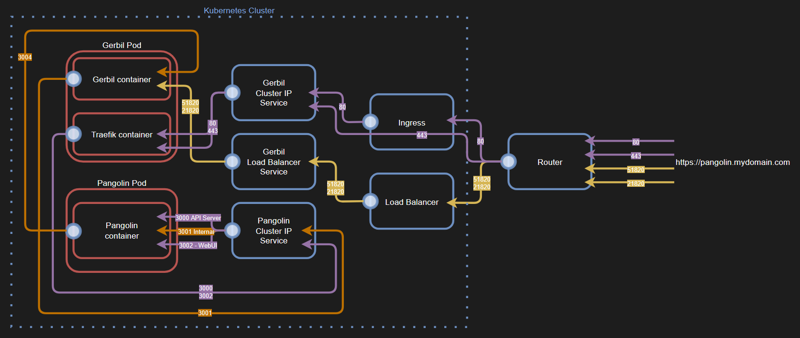

Unofficial Pangolin Helm chart



```bash
# Install example:
helm install pangolin . \
--set-string settings.pangolin.serverSecretKey=SECRET_KEY_HERE \
--set-string ingress.hostDomain="mydomain.com" \
--set-string volumes[0].name=vol-pangolin \
--set-string volumes[0].nfs.path=/volume/cluster/pangolin \
--set-string volumes[0].nfs.server=nas.lan \
--set-string ingress.issuer="letsencrypt-cert-prod" \
--set ingress.tlsEnabled=true \
-n prod

# Uninstall example:
helm uninstall pangolin -n prod
```
